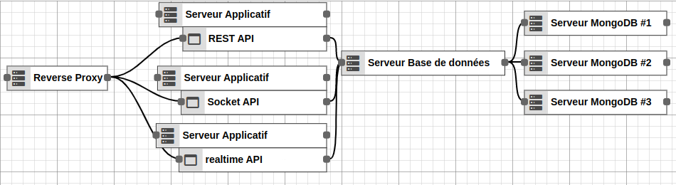
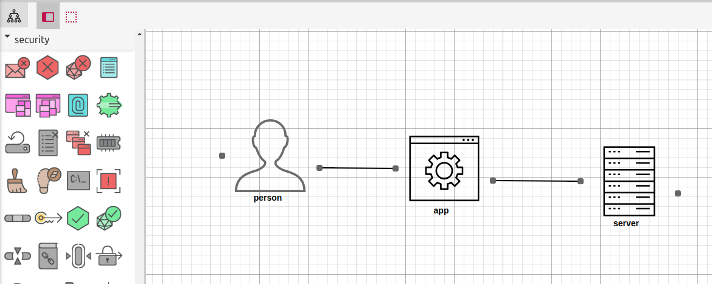

# vue-diagrams

> Diagram component for vue.js, inspired by react-diagrams





[See the website for documentation and demos](https://vue-diagrams.js.org/)

## Installation
```
npm install vue-diagrams
```
```
yarn add vue-diagrams
```


### After that, you can use it in your Vue components:

```html
<template>
  <diagram :model="model"></diagram>
</template>
<script>
import { Diagram } from 'vue-diagrams';

export default {
  data() {
    const diagramModel = new Diagram.Model();

    const node1 = diagramModel.addNode("test2", 300, 200);
    const inPort = node1.addInPort("test");

    const node2 = diagramModel.addNode("test", 10, 300, 144, 80);
    const node2OutPort = node2.addOutPort("testOut");
    node2.addOutPort("testOut2");
    node2.color = "#00cc66";

    const node3 = diagramModel.addNode("test3", 10, 100, 72, 100);
    const node3OutPort = node3.addOutPort("testOut3");
    node3.color = "#cc6600";

    diagramModel.addLink(node2OutPort, inPort);
    diagramModel.addLink(node3OutPort, inPort);

    return {
      model: diagramModel
    };
  },

  components: {
    Diagram
  },
};
</script>
```

## Changelog

See the GitHub [release history](https://github.com/gwenaelp/vue-diagrams/releases).

## Contributing

See [CONTRIBUTING.md](.github/CONTRIBUTING.md).
