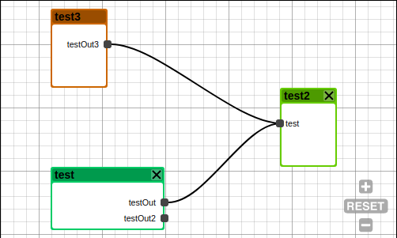

# vue-diagrams


[](https://github.com/semantic-release/semantic-release)

[](https://travis-ci.org/gwenaelp/vue-diagrams)

> Diagram component for vue.js, inspired by react-diagrams



> Generated using [vue-cli-template-library](https://github.com/julon/vue-cli-template-library).

## Installation
```
npm install vue-diagrams
```
vue-diagrams can be used as a module in both CommonJS and ES modular environments.

When in non-modular environment, vue-diagrams will register all the components to vue by itself.</p>

### After that, you can use it in your Vue components:

```html
<template>
  <diagram :model="model"></diagram>
</template>
<script>
import { Diagram } from 'vue-diagrams';

export default {
  data() {
    const diagramModel = new Diagram.Model();

    const node1 = diagramModel.addNode("test2", 300, 200);
    const inPort = node1.addInPort("test");

    const node2 = diagramModel.addNode("test", 10, 300, 144, 80);
    const node2OutPort = node2.addOutPort("testOut");
    node2.addOutPort("testOut2");
    node2.color = "#00cc66";

    const node3 = diagramModel.addNode("test3", 10, 100, 72, 100);
    const node3OutPort = node3.addOutPort("testOut3");
    node3.color = "#cc6600";

    diagramModel.addLink(node2OutPort, inPort);
    diagramModel.addLink(node3OutPort, inPort);

    return {
      model: diagramModel
    };
  },

  components: {
    Diagram
  },
};
</script>
```

## Changelog

See the GitHub [release history](https://github.com/gwenaelp/vue-diagrams/releases).

## Contributing

See [CONTRIBUTING.md](.github/CONTRIBUTING.md).
